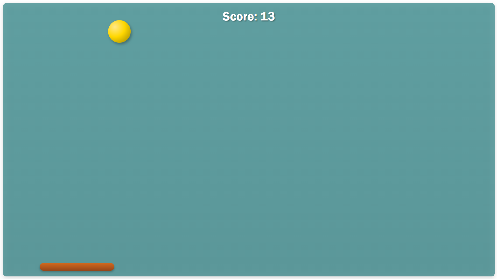
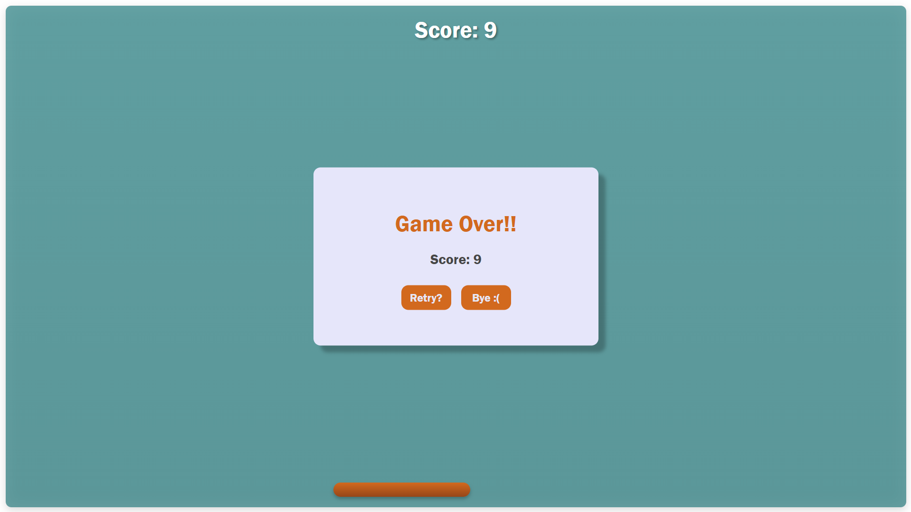

# Bouncy Ball Game

A simple browser-based game built with **HTML, CSS, and JavaScript**.

The objective is to keep the bouncing ball from falling by moving the paddle horizontally with the mouse. Each successful paddle hit increases the score.

## Features

* Bouncing ball with collision detection
* Mouse-controlled paddle
* Score counter for successful hits
* Bounce sound effect
* Restart option after Game Over
* Responsive game area that adapts to the browser window
* Gradient-based visual styling and simple animations

## Technologies Used

* **HTML5** – Game structure and elements
* **CSS3** – Styling, layout, gradients, and visual effects
* **JavaScript** – Game logic, animation, mouse interaction, collision detection, and scoring
* **MP3 Audio** – Bounce sound effect

## How to Play

1. Open `BouncyBallGame.html` in a web browser.
2. Move your mouse horizontally to control the paddle.
3. Keep the ball from falling below the paddle.
4. Successfully hitting the ball increases your score.
5. If the ball falls past the paddle, the game ends.
6. Click **Retry** to start a new game.

## Project Structure

```text
BouncyBallGame/
│
├── BouncyBallGame.html
├── Bounce.mp3
└── README.md
```

## Screenshots




## What I Practiced

This project helped me practice:

* DOM manipulation
* Mouse event handling
* Animation using `requestAnimationFrame()`
* Collision detection
* Dynamic positioning and responsive dimensions
* Basic game-state management
* Audio playback with JavaScript

## Author

**Prerana Banerjee**
